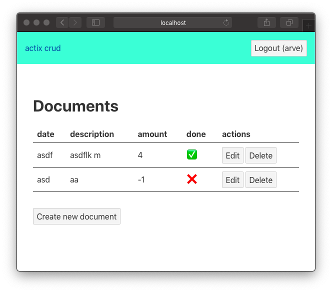

# actix crud
An implementation of create, read, update and delete over HTTP with [actix-web](https://actix.rs), [SQLite](https://www.sqlite.org) and [svelte](https://svelte.dev). Live updates via [server sent events](https://developer.mozilla.org/en-US/docs/Web/API/Server-sent_events), also known as EventSource.



## Running
```sh
# start server
cargo run --release
# in another terminal
curl localhost:8080
# or open browser
open http://localhost:8080
```

Index is served from [client/public/index.html](./client/public/index.html),
static files are served from [client/public/static](./client/public/static).

See [test.sh](test.sh) or [the client implementation](./client) for how to:

- register users
- login
- CRUD-ing documents


## Development
```sh
# install cargo-watch if not present
cargo install cargo watch
# start server, compile and restart on changes to files
cargo watch -w src -x run
# run tests in another terminal
./test.sh
```

### Client development
See [client README](./client/README.md).
